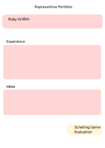
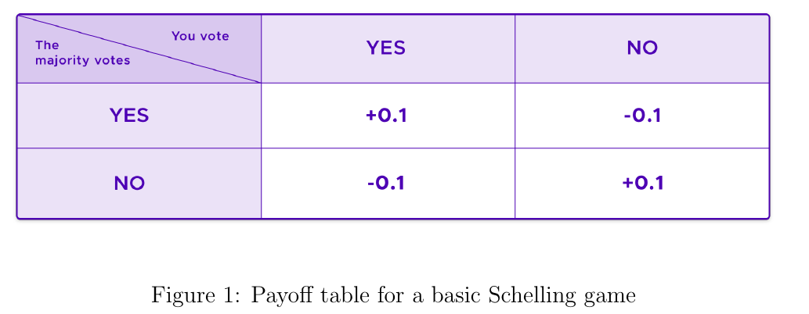
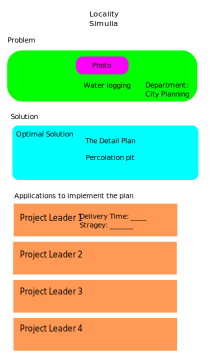

# Shivarthu: A Governance Protocol


## Overview

Shivarthu: The blockchain-based decentralized governance system. Democracy is about fair and equal treatment of everyone in a country. But it becomes unrealistic to achieve when political parties have their conflict of interest, and leaders don’t have the expertise to make evidence-based policies and neither have the skill and manpower for solving problems that surround our society and ecosystem. The new fair democracy provides an elegant way of governance that separates the representative responsibility according to their specialization and can grow into any complexity. The governance is divided into various departments, and each department is supervised by representatives with expertise in the field. Rational voters who have a sufficient understanding of the departments and their issues will be given more weight in the voting process than other voters. It results in a self-reinforcing feedback loop that eliminates frivolous actors and leaves utilitarian ones in charge.

<https://shivarthu.reaudito.com/paper/Shivarthu_whitepaper.pdf>

Shivarthu will be build on Substrate.

Our democracy has many challenges, blockchain can provide a way to tackle those challenges by minimizing trust through game theory.  That made our team interested in creating this project.


### Project Details

Project Github link: <https://github.com/reaudito/shivarthu>

### Departments:

The governance is divided into many departments like education, infrastructure, health, community service for every locality.

### Expertise evaluation of representatives :

Voters and especially representatives need to have some experience or expertise in the department. Experience is required because education about the department leads to better decision making.
Their kyc and experience is evaluated by schelling game.

### Vouching

A family tree is constructed.
If they know each other, friends and relatives will become guarantors for each other.
Moderators chosen through approval voting have the ability to invalidate the fake vouching by down voting the guarantor.


Experience evaluation pallet
<https://github.com/reaudito/shivarthu/tree/main/custom-pallets/profile-validation>





## The Schelling Game:

### The schellingCoin

The SchellingCoin is designed to encourage truthfulness through economic incentives. The coin's mechanism is based on the concept of Schelling Points, as described by Thomas Schelling.

In essence, the idea is to create a scenario where individuals are motivated to tell the truth because they expect others to do so as well. In the case of the SchellingCoin, if we wanted to know if it rained in Paris this morning, we could ask every owner of the coin to vote secretly on whether it rained or not. After all the votes are cast, the results would be revealed, and those who voted in agreement with the majority would be rewarded with 10% of their coins, while those who voted differently would lose 10% of their coins.

The SchellingCoin's mechanism is rooted in the concept of focal points, which Schelling described as "each person's expectation of what the other expects him to expect to be expected to do." In this case, the focal point is honesty. The idea is that every individual in the system expects others to vote truthfully, because they expect others to expect them to vote truthfully. This creates a self-reinforcing loop, where individuals are incentivized to tell the truth because they believe others will do the same.



[Kleros Whitepaper](https://42683ff2b1a2ac5ad2fef0ee01995d78.ipfs.4everland.link/ipfs/bafybeiarvlogal2u7i566wdfwjqty53giccwmb6tcjz6zrmvs3rt56j37y)

### Effectiveness of Schelling Game

The Schelling game of Shivarthu is designed to incentivize participants to reveal truthful information by rewarding them based on the majority consensus.

In the Schelling game, participants are asked to vote on the outcome of a particular event or question. They are rewarded based on the accuracy of their vote and the overall consensus among the participants. The idea is that participants will have an incentive to vote honestly in order to maximize their potential rewards.

> The effectiveness and accuracy of the Schelling game, like any decentralized system, depend on several factors:
>
> Participation: The accuracy of the results can improve with a larger number of participants. More participants increase the diversity of perspectives,reducing the potential for bias or manipulation.
>
> Token Staking: In the protocol, participants must stake tokens as collateral, which can be lost if they vote against the majority outcome. This mechanism provides an additional incentive for participants to vote honestly.
>
> Jury Selection: It utilizes a random selection process to form a jury panel from the pool of participants. This randomness helps prevent collusion and bias within the jury.

The accuracy of the Schelling game can vary depending on the specific context and the quality of information available. It is important to note that no system can guarantee 100% accuracy. Factors such as the complexity of the question, the availability of information, and potential manipulation attempts can influence the accuracy of the results.

However, decentralized systems like Schelling game aim to mitigate biases and provide a fair and transparent mechanism for dispute resolution. By incentivizing truthful voting and random jury selection, Schelling game aims to achieve a reasonable level of accuracy in determining the majority consensus. Nonetheless, it is advisable to consider the specific details and context of each use case when evaluating the accuracy of the system.

### Sybil Attack:

A Sybil attack is a type of attack on a peer-to-peer network or a decentralized system where an attacker creates multiple pseudonymous identities (Sybils) to gain a disproportionate control or influence over the network. This can be done by creating multiple fake identities, flood the network with fake requests, or manipulate the network's decision-making processes.

### How more stakes, more chances of selecting as juror protects from Sybil attack?:

In a system like the SchellingCoin, where the amount of stakes determines the chances of being selected as a juror, increasing the stakes for a node (user) makes it more difficult for an attacker to launch a Sybil attack. In a random selection process, an attacker could create multiple fake addresses to increase their chances of being selected as a juror. By being chosen more frequently than honest jurors, the attacker could effectively control the outcome. However, the stake-based selection mechanism ensures that only genuine users with a vested interest in the outcome are drawn as jurors, protecting the integrity of the system.


### Alternative to more stakes, more chances of selecting as juror:

Increased stakes and a greater likelihood of being chosen as a juror may lead to a concentration of wealthier individuals in the decision-making process. An alternative approach to mitigate Sybil attacks is to use Stake by KYC (Know Your Customer) and Positive Externality Score.

#### Stake by KYC:

In this approach, nodes are required to provide verifiable identification (KYC) to participate in the juror network. This ensures that each juror is a unique entity and cannot create multiple fake identities.

#### Positive Externality Score:

A Positive Externality Score can be used to incentivize jurors to behave honestly and contribute positively to the network. This score can be calculated based on the jurors behavior, such as the quality of its decisions, the number of honest votes, or the amount of valuable contributions it makes to the network.

By using Stake by KYC and Positive Externality Score, the network can promote accountability, authenticity, and cooperation among nodes, making it more resistant to Sybil attacks.

### Incentive system adaptation

No deductions will be made from your stake in the Schelling game if your accuracy is greater than 60%. Instead, any penalties will be applied to your rewards. Here's how it works:

- If you make 10 decisions and get 6 wrong and 4 right, you'll receive incentives for the correct decisions but incur disincentives for the incorrect ones. Specifically, you will earn incentives for the 4 correct decisions but face penalties of 1.5 times the number of incorrect decisions (6 * 1.5 disincentives).

- Both incentives and your original stake will be released only after you have made between 20 and 50 decisions.

- If your accuracy falls below 60%, a 5% to 10% cut will be made from your stake.

By ensuring there are fewer disincentives for staking and requiring at least 20 decisions to release the funds, we aim to increase voter participation.

### Does the Schelling game force you to vote based on majority opinion? In other words, can't you vote according to your independent thoughts?

First, money is not deducted from your stake; it's deducted from the incentives you're supposed to receive if you make many wrong choices. So, it’s fine to deviate from majority thinking. We can also have a platform for advocacy and discussion before the voting takes place, where you can present your arguments.

You don't know how the majority will vote during the commit period, you will know only during the reveal period. Putting some disincentives for going against the wisdom of the crowd is a good way to build pressure to vote truthfully.

Who will be the jurors, or who will participate in the crowd, is further filtered out and has a different weightage through a positive externality reputation system. As education is a positive externality, educated people will have more weightage for answering.

Furthermore, it's experimental. One must review the decisions made in a real setting and adjust based on feedback from participants. If good decisions can be made without financial penalties, that approach can also be considered.


## Where Schelling Game implemented in the project?

In this project, the Schelling game is employed to perform Know Your Customer (KYC) checks on users. Furthermore, a modified version of the Schelling game called the score Schelling game is applied to funding departments, incorporating both funding allocation and rating of users based on the positive externality they generate.

In the Schelling game, individuals who wish to participate as jurors can apply to make decisions. The likelihood of being selected as a juror is directly proportional to the number of tokens a juror stakes. The more tokens a juror stakes, the greater their chances of being chosen. Additionally, jurors are randomly selected, which helps safeguard the system against sybil attacks.

We will use the substrate randomness trait for generating a random number.
<https://docs.substrate.io/reference/how-to-guides/pallet-design/incorporate-randomness/>

Then jurors will vote for their decision using the commit and reveal scheme. In the commit phase, they submit the hash of the vote string. Then, in the reveal phase, they submit the hash and the vote string. If the vote string matches with the hash, then the vote is accepted.
If a juror's vote is coherent (more than 51% of other jurors agree) then they receive incentives, otherwise, incentives are deducted from the stake of the juror.

Sortition Sum Game Algoritm:

[An Efficient Data Structure for Blockchain Sortition](sortition_sum_game.pdf)


Sortition Sum Game pallets:
<https://github.com/reaudito/shivarthu/tree/main/custom-pallets/sortition-sum-game>


## Voting for selection of department representatives:

The election will be conducted using a multi-winner approval system. To choose the representatives, we will employ the sequential Phragmén method on the substrate. In this approach, instead of using stake, we will consider the vote weight based on factors such as reputation, experience, and positive externality scores. These scores are determined by the level of participation in the network or the positive external effects they have generated. As mentioned earlier, the positive externality score is calculated using the score Schelling game.

<https://paritytech.github.io/substrate/master/sp_npos_elections/phragmen/fn.seq_phragmen.html>

Approval Voting:

Winners:


Seq phragmen voting:
<https://github.com/reaudito/shivarthu/tree/main/custom-pallets/election>


#### Voting for selection of governors

Governers will be selected again by seq phragmen, to form a fully decentralized governance they will have functions of setting different thresholds, like election timing, the number of elected representatives, and approving departments that can be formed.


#### Project application and acceptance:

The representatives are in charge of accepting the incoming projects for funding.
People will submit their problems, for example, waterlogging in the locality.
Then experts all around the globe will submit the solution. The solution will be peer-reviewed to check its pros, cons, and suggest improvements that can be made. The review must meet the scientific guidelines. The solution can undergo revision through peer review feedback.
The solution provider and peer reviewer have to stake some money to receive incentives for their work. The solution and peer review will again be approved and disapproved through the shelling game after checking whether the content meets the quality as recommended in scientific guidelines. The solutions provider and reviewer will get the incentives if it gets approved, otherwise, some money will be cut from the stake. It creates pressure on the reviewer to maintain quality without noise.


The representatives of the department will select the most optimal solution.
After that persons wanting to take the lead to implement the solution will apply. Again representatives will select the best project leader from the application.




## Money for department:

Form a department with a location with some min members, say 3000, and get it approved by the main governance.

### Department price discovery:

Say we have 1,000,000 departments with 3000 population each.

Department funding operates on a tipping system where each department is categorized as either a SmallTipper, BigTipper, SmallSpender, MediumSpender, or BigSpender, each corresponding to an increased funding value.

The funding categories are represented by an enumeration:

```rust
pub enum TippingName {
    SmallTipper,
    BigTipper,
    SmallSpender,
    MediumSpender,
    BigSpender,
}
```

Department-appointed governors are required to apply for the spending value, which can take any numerical value but must not exceed the specified limit associated with the tipping name. For example, if the allowed limit for SmallTipper is 10,000 tokens, applications for SmallTipper must be for an amount less than or equal to 10,000 tokens.

Applying for larger funds necessitates a greater stake in the form of increased responsibilities or commitments.

The amount is released after it is validated by the Yes or No Schilling game.

To utilize department funds, there is a process called Project Tips, wherein individuals or teams apply using a procedure similar to that of determining department funding

### Further improvements

Create guidelines for department formation, e.g. specifying which values are allowed and which are not. These guidelines will serve as the basis upon which the maximum tipping amount is decided by the juror. There can be logic for department approval based on meeting the guidelines. A department can only apply for funding if it is approved. Approval can be obtained through Seq phragmen governance.

## Price discovery of positive externality through Score Schelling Game:

1) When you submit a positive externality that you made, you need to provide details of your work.
2) Here is how the score Schelling game works to calculate score. For example, you can have a score between -10 and +10. The range of -10 to +10 poses a problem because the mean works best without extreme values. If someone gives -10, and others give 1, the mean result can be skewed due to the -10 outlier. The trick is to remove outliers by computing the standard deviation and eliminating all values more than one standard deviation away from the mean. Subsequently, we calculate the new mean of the remaining values, which consist of atleast 68.27% of the dataset. This new mean becomes the score. If your given score is close to the new mean, you receive incentives. If it deviates from the new mean, a portion of your staking value is deducted. Commit and reveal scheme is used.


Code to calculate new mean:

```python
import statistics


def calculate_new_mean(items):
    mean = statistics.mean(items)
    print(mean)
    sd = statistics.stdev(items)
    print(sd)


    #The values less than one standard deviation away from the mean account for 68.27% of the set
    #So we calculate mean of this 68.27% of data removing outlier

    # New data
    new_items = []
    for x in items:
        if x >= mean - sd and x <= mean + sd:
            new_items.append(x)

    print(new_items)

    new_mean = statistics.mean(new_items)
    print(new_mean)
    print("********************")

items = [-10, 1, 1, 1, 5, 1, 1, 7]
calculate_new_mean(items)
# 0.875
# 4.969550137731641
# [1, 1, 1, 5, 1, 1]
# 1.6666666666666667
# ********************
items2 = [-10, -10, 0, 0, 0, 0, 0, 1, 0, 0, 0, 0]
calculate_new_mean(items2)
# -1.5833333333333333
# 3.941811612428832
# [0, 0, 0, 0, 0, 1, 0, 0, 0, 0]
# 0.1
# ********************
items3 = [-10, -10, 0, 0, 0, 0, 0, 1, 0, 0, 0, 0, -9, -8, -7, -6, -5, -4, -3, -2, -1]
calculate_new_mean(items3)
# -3.0476190476190474
# 3.8141341150540375
# [0, 0, 0, 0, 0, 0, 0, 0, 0, -6, -5, -4, -3, -2, -1]
# -1.4
# ********************
```

3) Then, we will do quality score voting Schelling game that checks the quality or impact of positive externality. The score range is 0-5
4) A fixed amount of tokens is released for each score. The highest amount of tokens will be released for a score of 5, fewer tokens for a score of 1, and no tokens for a score of 0.


### Randomized Tax collection

Initial project funding comes from inflation, however as the inflation rate declines over time, the funds are collected by subtracting some amount of balance from different accounts so that there is no longer any inflation.

To avoid creating disincentives to invest in the coin, tax collection or deduction of balance is randomized for every transaction.

During a transaction, a random value is generated between 0 and 10. If the drawn number is 0, no tax will be deducted. If the number is 10, a 5% tax will be deducted from the transaction. In the case of the drawn number being 5, a 2.5% tax will be deducted.

Another way of tax collection, but less simple:

An account number is assigned to each account starting from 1000 in ascending order. A random number n between 1-1000 is drawn.

All account numbers with account_number % 1000 == drawn random number are taxed

If the drawn number is 1,000, one out of every 1,000 accounts will be taxed.

The primary governance determines the tax rate. The block number is stored during the draw. One draw is conducted each month at random time. Tax is deducted when the account interacts with the blockchain.

### Why tax collection, not inflation?

The current price of token is being impacted by a combination of psychological and economic factors due to inflation. As inflation rises, sell pressure increases, leading to fear and uncertainty among investors, causing them to seek hedging in alternative assets with lower inflation rates. This heightened sell pressure can trigger panic selling and herd behavior, further driving down the token's price. Additionally, loss aversion and recency bias intensify these effects, causing investors to overreact to the lack of price movement. Loss aversion suggests that the pain of losing is twice as powerful as the pleasure of gaining, while recency bias gives greater importance to recent events over historical ones, further influencing investor behavior.

### Why inflation?

Money circulation is the fundamental principle for a thriving economy. Deflationary currency tends to decrease circulation, as people are inclined to hold onto it, which can, in turn, lead to increased poverty and wealth concentration. On the other hand, inflationary currency can be beneficial if money is distributed fairly, ensuring continuous circulation. However, it is crucial that this distribution is managed in a way that does not create negative externalities.

The challenge lies in maintaining the balance; A token can be inflationary, but you receive rewards for staking or holding it, which cancels out the devaluation caused by inflation.
